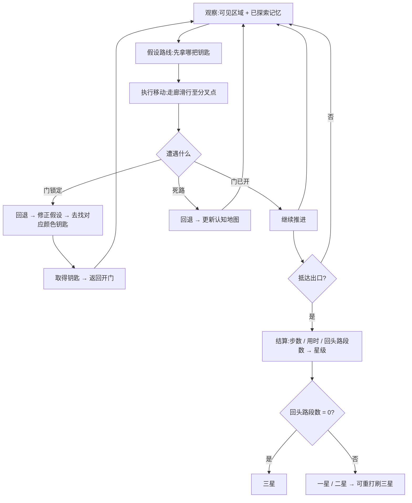

# 迷宫寻路游戏 · 概念文档

> 版本：v2.2 | 阶段：Phase 1 概念孵化 · 评审强度：lean
> 作者：文策渊（设计策略师）
> 状态：裁决已全部落定正文；仅剩 3 项生成器 GDD 的残余待定（§10.2），不阻塞其他 GDD 开工

## 修订记录

| 版本 | 变更 |
|---|---|
| v1 | 初稿。8 节 + 开放问题。 |
| **v2** | 并入用户裁决 D1–D4 与主理人技术裁决 C3。六处实质变更：<br>① **范围分层重构**：每日种子 + 程序化生成器 + 求解器从扩展范围移入核心范围（D4 连锁）；砍掉关卡编辑器、主线扩容、新机制候选作为补偿。<br>② **星级口径改为"通关 + 零回头路"**（D3），给出可代码化的精确判定定义。<br>③ **迷雾确认为关 9 起启用**（D2）：动词表加"生效阶段"列消除自相矛盾；视觉锚点 2 明确为**关 1–8 三态 / 关 9 起四态**。<br>④ **视觉锚点 1 定稿为暖调纸感**（D1）；锚点 2、3 改写为亮底适配的目标式表述。<br>⑤ **关卡硬上限收到 13×13**（C3），并补充尺寸递进 9×9→11×11→13×13 与"13×13 含外墙"的口径澄清。<br>⑥ **R1 / R4 验收口径重写**，新增 QA 门禁"每关必须存在零回头路解"。 |
| **v2.1** | 落定 §10 四项裁决（撤销擦除回头路 / 13×13 含外墙 / 每日种子固定中高两档 / 生成器实现归 engineering-lead）。四处正文改动：§3「撤」动词写入回滚语义、§5.4 撤销注改写为已裁决结论、§5.2 标题加"含外墙"、§5.1 #6 与 §5.5 G6 写入固定档位。另修正一处 v2 内部不一致：§5.5 G5 澄清"门 ≤ 3 与依赖链 ≤ 2 并存"的并列/串联含义。 |
| **v2.2** | 同步 D8 措辞：全文「每天一张新图」统一改为「每天两张（中档 + 高档各一张，玩家自选）」，消除与已冻结裁决 D8 的矛盾；评审 Phase 2 · PASS（2026-09-07）。 |

---

## 0. 已锁定前提（用户拍板，本文不推翻）

| 项 | 结论 |
|---|---|
| 技术栈 | 原生 HTML5 Canvas 2D + TypeScript，不使用任何游戏框架 |
| 核心玩法 | 俯视角 2D 网格迷宫寻路：找钥匙 → 开门 → 抵达出口，关卡难度递进 |
| 平台 | 仅桌面浏览器，键盘（方向键 / WASD）输入 |
| 评审强度 | lean（短而具体，禁止方法论铺陈） |

**v2 新增——用户裁决（D1–D4）与主理人技术裁决（C3）**：

| 编号 | 裁决项 | 结论 |
|---|---|---|
| D1 | 视觉风格 | **暖调纸感**（采纳锚点 1，非冷调暗底） |
| D2 | 视野处理 | 关 1–8 全览，**关 9 起主线启用迷雾** |
| D3 | 三星阈值 | **仅按是否通关 + 是否零回头路**（不计算最优步数） |
| D4 | 每日种子 | **提前至核心范围，MVP 必做**（连带生成器进核心） |
| C3 | 关卡尺寸 | 硬上限 **13×13**（40px 单元格 → 520×520，四周 36px 安全边） |

本文只回答"做什么、为什么做、不做什么"。数值细则与系统实现属 Phase 2 GDD，美术规范属美术圣经，均不在本文范围。

---

## 1. 电梯陈述与三条设计支柱

### 电梯陈述

> **在一屏可见的小迷宫里，先在脑子里把路走一遍，再动手——找齐钥匙、按顺序开门、以一条不走冤枉路的干净路线抵达出口。**

### 支柱一：可推理的公平

**每一把锁的解法，玩家在看懂规则后都能推出来，不需要猜、不需要试错、不需要反应力。**

因此我们不做什么：
- 不做隐藏机关、隐藏通道、像素级搜索式藏物
- 不做随机失效、概率判定、"这次运气不好"
- 不做任何需要操作精度或反应速度的考验（无 QTE、无限时闪避、无精确跳跃）

判据：设计者必须能用**一句话**说清某一关的解法。说不清 → 该关不合格。

### 支柱二：想的时间 > 走的时间

**难度来自拓扑结构（锁钥依赖深度、死路诱导），不来自地图面积。关卡刻意做小。**

因此我们不做什么：
- 不做大地图跑图（**硬上限 13×13**，见 C3）
- 不做"就只是大"的关卡、不做无信息量的长回廊
- 不做摄像机跟随与滚动（放不进一屏 = 关卡超标，改关卡不改摄像机）

判据：单关按键次数 < 移动格数 × 40%。超过则说明玩家在做体力劳动而非决策。

### 支柱三：一关一谜题

**每关是一个自足的、30 秒到 3 分钟的小谜题，有清晰的"解开了"瞬间。关与关之间不累积数值。**

因此我们不做什么：
- 不做角色成长、等级、装备、技能树
- 不做资源 farming、货币、内付费
- 不做任何"必须重复刷同一关才能推进"的进度门槛

判据：拿到 1 星即可解锁下一关。三星是可选挑战，不是通行证。

---

## 2. MDA 分析

### Mechanics（机制，规则层）

| 机制 | 说明 |
|---|---|
| 网格移动 | 4 向、格子对齐；长按连续移动；撞墙不消耗步数 |
| 走廊滑行 | 按一次方向键，角色自动走到下一个需要决策的分叉点 |
| 视野迷雾 | **关 9 起启用**；仅视野半径内可见；已探索区域永久留存 |
| 钥匙-锁-门 | 3 色配对；门面直接显示所需颜色；依赖链 ≤ 2 层 |
| 出口 | 满足解锁条件后开启，进入即通关 |
| 步数 / 计时 | 双维度统计（展示用，不驱动星级） |
| 零回头路判定 | **驱动星级**（精确定义见 §5.4） |
| 试错安全网 | Z 单步撤销、R 整关重开，零惩罚 |
| 关卡选择与进度 | 逐关解锁、星级持久化（localStorage） |
| 每日种子 | 同种子同图，主线通关后解锁（v2 新增，见 §5.1） |

### Dynamics（动态，运行层）

1. **认知地图构建**：玩家在脑中累积"已探索区域"，从随机游走逐步转向系统遍历（贴墙法 / 深度优先）。这是本作真正的学习曲线。关 9 起迷雾使这一层从"辅助"升为"核心"。
2. **排序决策与白跑代价**：锁钥依赖让"先拿哪把钥匙"成为真实决策。拿错顺序 → 撞上锁着的门 → 回退。回退的长度就是这关的难度。
3. **死路诱导**：设计者刻意放置"看起来通向出口"的假路径，制造一次可承受的挫败与随后的"啊哈"。
4. **从"找到路"到"找好路"**：星级一旦出现，玩家动机从可解性转向**路线的干净程度**，同一关产生第二次游玩价值。
5. **熟练度压缩**：重打一关时，认知地图已存在，时长从 90 秒压到 20 秒，产生明确的胜任感回报。
6. **每日种子的仪式感**（v2 新增）：每天两张陌生的新图（**中档 + 高档各一张，玩家自选**），认知地图归零，把 Dynamics 1–2 重新激活一次。这是主线通关后唯一的"新鲜感来源"，也是把 Explorer 留在游戏里的机制。

### Aesthetics（美学，体验层）

| 审美 | 定位 | 依据 |
|---|---|---|
| Challenge（挑战） | **主审美** | 核心乐趣是"解开它" |
| Discovery（发现） | **副审美** | "啊哈"时刻：原来得先拿蓝钥匙 / 原来这里有条近路 |
| Submission（消遣） | **副审美** | 短关卡、低门槛，适合随手来两关或每日一局 |
| Fantasy / Narrative | 不追求 | 无世界观、无剧情（见 §5.3） |
| Fellowship / Competition | 不追求 | 无联机、无排行榜；每日种子提供**弱**关联感，但非社交系统 |
| Expression / Sensation | 不追求 | 无自定义；视听服务于可读性而非沉浸 |

### 预期玩家体验（一句话）

> 坐在椅子上，盯着一个不大的迷宫，先在脑子里把路走一遍，再动手。卡住半分钟，然后"哦，得先拿蓝钥匙"，花二十秒走完，进入下一关。主线通关后，每天来打一张陌生新图。

---

## 3. 动词优先法

玩家实际能做的事。**本作物理动词只有"走"，设计重心必须放在认知动词上**，否则游戏会退化成体力劳动（见风险 R2）。

v2 修正：D2 裁决确认前 8 关无迷雾，因此动词需标注**生效阶段**，否则"看"在关 1–8 无处依附，动词清单自相矛盾。

| # | 动词 | 类型 | 生效阶段 | 对应机制 | 设计意图 |
|---|---|---|---|---|---|
| 1 | **走** Move | 物理 | 全程核心 | 4 向网格移动、格子对齐、长按连走、走廊滑行到分叉点 | 把"走"的成本压到最低，为思考让出时间 |
| 2 | **看** Scout | 认知 | **关 1–8 辅助 → 关 9 起核心** | 关 1–8：**已走过路径留存（trail）**；关 9 起：视野迷雾 + 已探索区留存 + 当前位置持续可见 | 探索产生持久资产（认知地图），不是白走 |
| 3 | **配** Match | 认知 | **关 4 起核心**（关 1–3 无锁，暂缺） | 3 色钥匙-锁-门、门面显色、依赖链 ≤ 2 层 | 本作核心解谜动作：推断取钥匙的正确顺序 |
| 4 | **省** Optimize | 认知 | 全程核心 | 步数/计时展示 + **零回头路星级判定**（§5.4） | 把单次通关变成可重复优化的题目 |
| 5 | **撤** Undo | 支撑 | 全程支撑 | Z 单步撤销、R 整关重开，零惩罚不计失败；**撤销会回滚路径，回头路记录随之擦除**（已裁决，见 §5.4 注） | 安全网。把试错代价从"几分钟"压到"几秒"，直接对抗迷路挫败 |

**"看"的分阶段说明（消除矛盾）**：
- 关 1–8（全览）：玩家不需要探索未知，"看"退化为**辅助动词**，其机制载体是**已走过路径的留存**——它仍有用（避免重复绕路、便于规划），但不构成挑战。此阶段的核心动词是"走"与"省"。
- 关 9 起（迷雾）："看"升级为**核心动词**，机制载体变为"视野迷雾 + 已探索区留存"，探索本身成为挑战。

**关 1–3 的动词密度说明**：该阶段只有"走"与"省"两个核心动词，是**有意为之**的极简教学。其趣味由"省"承担（找最短路），避免纯走路。

**动词配比目标**：一局中"配"和"省"占用的思考时间应显著多于"走"占用的执行时间。若实测相反，说明关卡设计失败。

---

## 4. 玩家心理学

### 4.1 自我决定论（SDT）

| 需求 | 本作强度 | 设计支撑 |
|---|---|---|
| **自主 Autonomy** | 强 | 玩家自选探索顺序、自选是否追三星、自选撤销还是硬扛、自选重打还是推进。1 星即解锁，进度永不锁死。**v2**：每日种子可玩可不玩，不影响主线进度。 |
| **胜任 Competence** | 强 | 30s–3min 短反馈环；每关有明确"解开了"瞬间；三星 = 零回头路（可达但需想清楚路线，不要求最优解）；重打时时长显著压缩，胜任感可量化。 |
| **关联 Relatedness** | **中（v2 提升）** | 单机、无剧情、无社交。补偿手段：**每日种子挑战已进核心范围（D4）**——同种子同图，玩家可与他人比对自己在同一张图上的成绩，形成"同一天解同一道题"的弱共同体验。 |

> v1 标注关联感为"最弱一环"并建议 MVP 接受它；D4 裁决提升了补偿力度。需注意：每日种子提供的是**弱关联**（共同话题），不是社交系统——无账号、无好友、无排行榜。这一上限不应被后续需求突破。

### 4.2 心流平衡与难度曲线

**难度由三个独立旋钮构成，逐关只动其中一个**（防止难度断崖的核心纪律）：

| 旋钮 | 取值 |
|---|---|
| D1 拓扑复杂度 | 死路密度、分支深度、假路径数量、网格尺寸 |
| D2 锁钥依赖深度 | L0 无锁 → L1 钥匙直接开门 → L2 钥匙开门后再取钥匙 |
| D3 视野约束 | 全览（关 1–8）→ 半径迷雾（关 9 起） |

**教学与引入序列**（v2：补入尺寸递进，尺寸随 D1 同步递增）：

| 关卡 | 尺寸（含外墙） | 引入内容 | 动的旋钮 |
|---|---|---|---|
| 1–3 | 9×9 | 全览、无锁。只教"走"与"省" | —（教学） |
| 4–8 | 11×11 | 引入单锁（L0 → L1） | D2 |
| 9–12 | 13×13 | 引入视野迷雾，锁钥升至 L2 | D3，随后 D2 |

**难度高峰与喘息关**：关 5、关 10 为难度高峰；关 6、关 11 为喘息关（沿用上一关机制，但缩小死路数量与锁数）。

**心流维持参数**：

- 单关预期卡壳时长目标：**20–90 秒**。低于 20 秒无挑战感，高于 90 秒进入焦虑区。
- 卡壳超过 **2 分钟**无进展 → 触发提示（扩展范围，可关闭）。
- **关 9 是全程最大的单次跃升点**（同时引入迷雾 + L2 依赖），因此关 9 自身的拓扑复杂度必须**下调**一档作为补偿——"引入新机制时降低其他旋钮"是难度设计纪律的例外条款，仅此一处。

### 4.3 Bartle 玩家类型定位

| 类型 | 定位 | 含义 |
|---|---|---|
| **Achiever（成就者）** | **主要目标** | 通关全部关卡、收集全三星是主驱动。**因此每关（含生成关卡）必须存在零回头路解**，否则三星不可达、成就者失去锚点（见 §5.5 QA 门禁 G3）。 |
| **Explorer（探索者）** | **次要目标** | 迷宫拓扑的发现感。由"省"动词、星级与**每日种子**共同承载。 |
| Killer（征服者） | 不为 | 无 PvP、无排行榜 |
| Socializer（社交者） | 不为 | 无社交系统；每日种子仅提供弱共同话题 |

---

## 5. 范围分层三层表

### 5.1 核心范围（MVP 必须有）— 10 条

> v1 为 8 条。D4 裁决使每日种子 + 生成器 + 求解器入核心，净增 2 条（大量合并后）。

1. **渲染与循环**：无框架 Canvas 2D + TypeScript；1080p 下 13×13 网格（40px 单元格 → 520×520，四周 36px 安全边）稳定 60fps；整关一屏显示、无滚动、无摄像机跟随。
2. **输入与移动**：方向键 / WASD 四向；格子对齐；长按连续移动；**沿走廊自动滑行至下一个分叉点**；撞墙不消耗步数。
3. **关卡数据结构（手工与生成同源）**：单一 TS 类型同时描述手工关卡与生成关卡，引擎不区分来源；可 JSON 序列化；确定性可复现。详见 §5.2 工程接口约束。
4. **求解器与 QA 门禁**：验证关卡可解性、标注解法长度、**是否存在零回头路解**。手工关与生成关共用同一门禁，详见 §5.5。
5. **手工主线 12 关**：尺寸递进 9×9 → 11×11 → 13×13（均为含外墙的外部尺寸）；三个难度旋钮逐关可调。
6. **程序化生成器 + 每日种子（D4）**：生成器按难度档位构造关卡；每日种子 = 以日期为种子，同种子同图；**主线 12 关通关后解锁**；**难度固定为中 / 高两档**（对应主线关 9–12 水平，不轮换、不自适应，见 §5.5 G6）。**实现归 engineering-lead，规格由设计侧在 Phase 2 GDD 定义**（见 §9）。
7. **锁钥系统**：3 色配对；门面直接显示所需颜色；依赖链深度 ≤ 2 层。
8. **视野与记忆**：关 1–8 全览（三态）；关 9 起视野迷雾（四态）；已探索区域永久留存；当前位置持续可见。
9. **试错安全网**：Z 单步撤销、R 整关重开，零惩罚、不计入失败统计；撤销会回滚路径（影响星级判定，见 §5.4 注）。
10. **结算星级与进度存档**：零回头路星级判定（§5.4）；关卡选择界面；1 星即解锁下一关；localStorage 持久化主线星级与每日种子成绩。

### 5.2 工程接口约束：关卡数据结构（**13×13 = 含外墙的外部总尺寸**，对工程侧的显式要求）

v1 原文是"让程基岩从一开始就设计成引擎与**未来**生成器共用"。**D4 后"未来"二字删除，这是 MVP 硬需求**。数据结构必须同时满足手工关卡与生成器的以下六项要求：

1. **同源同构**：手工关卡与生成关卡使用**同一个 TS 类型**，引擎渲染与判定逻辑中**不得出现 `isGenerated` 之类的来源分支**。
2. **可序列化**：可完整 JSON 序列化 / 反序列化，支撑每日种子的分享与未来导出。
3. **确定性可复现**：生成器必须使用**自带确定性 PRNG，禁用 `Math.random()`**；结构中不得含时间戳、随机 ID 等非确定字段。否则"同种子同图"不成立。
4. **可被求解器完整消费**：结构需表达全部可判定信息（墙、起点、钥匙、门及其颜色与依赖、出口），使求解器能独立判定可解性与零回头路解。
5. **难度旋钮可声明**：结构需能表达 D1（网格尺寸、死路数量）、D2（锁钥依赖深度）、D3（视野模式）三档，供生成器按档产出、供手工关卡标注自检。
6. **元数据字段**：每关需携带 `gridSize`、`visionMode`、`lockDepth`、`expectedSolution`（预期解法路径）。`expectedSolution` 是 R5 自检与 §5.5 QA 门禁 G2/G3 的输入，**不可省略**。

> **尺寸口径澄清（重要）**：13×13 为**含外墙的外部总尺寸**，内部可用空间为 11×11。若按"13×13 内部 + 1 圈外墙 = 15×15 外部"计算则需 600×600 > 592px 可用高度，不可行。工程侧实现时请以含外墙口径为准。

### 5.3 手工关卡与生成器的分工结论

**结论：并存，且分工边界清晰——手工关卡负责"教"，生成器负责"续"。**

| | 手工关卡（主线 1–12） | 生成器（每日种子） |
|---|---|---|
| 职责 | **教学与难度曲线**：逐关引入机制、控制节奏、埋设"啊哈"时刻 | **持续供给**：主线通关后每天两张新图（中档 + 高档各一张，玩家自选） |
| 为什么不能互换 | 生成器不会"教"。教学关需要刻意的极简（恰好一把锁、恰好一条诱导死路、零歧义），这是设计意图而非随机产物 | 手工关卡无法日更；且主线扩容的边际价值被每日种子替代 |
| 数量 | 12 关（不扩容，见 §5.4 砍掉项） | 1 关/天，无限 |
| 解锁 | 起始即开放（逐关解锁） | **主线通关后解锁** |

**为什么不让生成器替代手工关卡**：主线的本质是教学序列（关 1–3 无锁 → 关 4–8 单锁 → 关 9–12 迷雾 + 双锁），每一关的"只动一个旋钮"与"每 5 关一喘息关"都是设计意图。程序化生成教学关卡是一个研究问题，不是 MVP 任务。强行让生成器覆盖主线 = 放弃难度曲线控制，直接触发 R3。

**为什么每日种子要在主线通关后解锁**：避免新玩家第一天就撞上一张带迷雾与双锁的陌生图（那会把 R3 难度断崖与 R1 迷路挫败叠加）。主线通关的玩家已具备完整认知地图能力，此时陌生图才是乐趣而非折磨。

### 5.4 星级判定：零回头路（精确可判定定义）

> 以下定义必须能被代码直接判定，否则结算系统无法实现。

**基本定义**

| 术语 | 定义 |
|---|---|
| 移动 step | 角色从一格**成功**进入相邻格。撞墙（被阻挡未移动）不产生 step；撤销会移除 step |
| 进度事件 | **取得一把钥匙** 或 **开启一扇门**。抵达出口是终局事件，不算进度事件 |
| 进度节点 | 发生进度事件时所处的格子。**起点为第 0 个进度节点** |
| 段 segment | 相邻两个进度节点之间的路径（含起点格与终点格）。最后一段止于出口格 |
| 回头路 | 某一段内存在被访问 ≥ 2 次的格子 |

**判定规则**

```
1 星 = 通关
2 星 = 通关 且 回头路段数 ≤ 1
3 星 = 通关 且 回头路段数 = 0
```

**判定伪代码**

```
segments = []; cur = [startCell]
for step in path:                       // path 为实际发生的移动序列
    cur.append(step.destination)
    if step.triggeredProgressEvent:     // 取钥匙 / 开门（非抵达出口）
        segments.append(cur); cur = [step.destination]
segments.append(cur)                    // 最后一段止于出口格

backtrackSegments = count(s for s in segments if hasDuplicateCell(s))
star = 3 if backtrackSegments == 0
     : 2 if backtrackSegments <= 1
     : 1
```

**消除三处歧义（team-lead 点名要求）**

| 歧义 | 判定 |
|---|---|
| 重复走进同一个已访问格子，算不算回头路？ | **跨段不算，段内算。** 判定只看段内重复，全程重复访问是正常且必要的 |
| 走进死路再原路返回，算不算？ | **算**——若该段内未产生任何进度事件。若死路里有钥匙或门（产生了进度事件），则返回路径归入下一段，不计 |
| 为了拿钥匙而折返，算不算？ | **不算**——只要从上一进度节点到取得钥匙这一段路径本身无重复访问。钥匙在死胡同里是合法设计，不应被惩罚 |

**关键示例**

- 合法三星：`Start → A → B → C[取钥匙] → B → A → D → E[出口]`
  段1 `Start,A,B,C` 无重复；段2 `C,B,A,D,E` 无重复（B、A 在段1出现过，但段2内各一次）→ **三星**。钥匙在死胡同不惩罚。
- 丢失三星：`Start → A → B[死路，空] → A → C[取钥匙] → …`
  段1 `Start,A,B,A,C` 中 A 出现两次 → 1 段回头路 → **二星**。白跑一趟被正确惩罚。
- 丢失三星：`Start → A → B[门锁着，无钥匙] → A → C[取蓝钥匙] → …`
  在 B 未产生进度事件（门没开）→ 段1 中 A 重复 → **二星**。走错门被正确惩罚。

**注：撤销对星级的影响（已裁决：擦除）**

> **撤销会回滚 `path`，回头路记录随之擦除。这是既定语义，不是 bug——工程侧请勿实现成"撤销仍保留回头路记录"。**

理由：本作无排行榜、无 Killer 定位（§4.3），三星是个人胜任感来源而非竞争资本；且"用撤销在脑内试错"正是支柱二"想 > 走"鼓励的行为。

**实现要求**：`path` 必须是**可回滚**的移动序列，**不得**实现为只增不减的路径日志。
**被否决的替代方案**：撤销仍记录回头路（三星更硬核，但玩家会困惑"我明明撤销了怎么还扣"，且与"零惩罚试错"支柱冲突）。

### 5.5 QA 门禁：每关（手工与生成）必须通过

| 门禁 | 判据 | 成本 |
|---|---|---|
| **G1 可解性** | 存在一条从起点到出口、满足锁钥依赖的合法路径 | 求解器验证标注解法，O(路径长度) |
| **G2 长度上限** | `expectedSolution` 路径长度 ≤ 80 步 | 同上 |
| **G3 三星可达（硬）** | `expectedSolution` **本身是零回头路解**（按 §5.4 判定，回头路段数 = 0） | 同上 |

**G3 是本次修订新增的最重要门禁**。D3 把三星锚定在"零回头路"上，则**任何不存在零回头路解的关卡都会使三星不可达**——成就者失去锚点，SDT 胜任感崩塌。手工关卡与生成关卡都必须过 G3。

**注意：G1–G3 用"验证设计者标注的解法"，不用"搜索最优解"。** 计算量 O(路径长度)，成本约等于零，因此不违背 D3 裁决——D3 只是规定**星级不依赖最优步数**，并未禁止把求解器用作 QA 工具。

**生成器质量门禁（额外三条）**

| 门禁 | 判据 |
|---|---|
| G4 确定性 | 同种子必须产出逐字节相同的关卡。禁用 `Math.random()` |
| G5 尺寸与依赖合规 | 尺寸 ≤ **13×13（含外墙，内部 11×11）**；依赖链深度 ≤ 2；钥匙 ≤ 3；门 ≤ 3；死路分支 ≤ 6。**门 ≤ 3 与依赖链 ≤ 2 并存意味着：第 3 道门必须与前两道之一并列（同层），不得串联成第三层** |
| G6 难度档位命中 | 产出的 `expectedSolution` 长度落在该档位的目标区间。**档位已裁决为固定中 / 高两档**（对应主线关 9–12 水平）：中档 35–55 步，高档 50–80 步。**不采用按星期轮换，也不采用自适应难度**——后者会破坏"同种子同图"的可比性 |

**生成方式的设计侧建议**：采用**构造式生成**（先造一条零回头路的主干解路径 → 在主干上撒入钥匙与门形成依赖链 → 添加死路分支作为干扰 → 用求解器复验 G1–G3），而非"随机生成 + 校验"。理由：随机迷宫 + 随机锁钥同时满足 G1/G3/G6 的命中率极低，会大量空转；构造式生成 100% 命中 G3。**最终实现方案由工程侧定，但必须满足 G1–G6。**

### 5.6 扩展范围（MVP 后有则更好）— 4 条

> v1 为 7 条。生成器与每日种子移出后，砍掉 3 条（见 §5.7），保留并新增如下。

1. **提示系统**（优先级提升）：卡壳 120 秒后高亮下一个目标，可开关。它是 R1 / R4 的缓解措施，工期允许时应尽早做。
2. **玩家笔记**（价值随 D4 上升）：允许在已探索格上打标记。每日种子每天两张陌生新图（中档 + 高档各一张，玩家自选），记忆负担比主线更重，笔记的边际价值因此**高于** v1 评估。
3. **每日种子历史与连胜统计**：本地记录每日成绩与连续通关天数。低成本，且是关联感与胜任感的最小增量补偿。
4. **音效与 BGM**（交音频）。

### 5.7 明确砍掉（本次不做）— 12 条

> v1 为 8 条。**v2 新增 3 条（#9–#11）作为 D4 范围扩张的补偿项**，另新增 #12 防止 D3 被重新提出。#7 口径随 C3 更新。

1. 移动端 / 触屏 / 虚拟摇杆适配
2. 角色成长、等级、装备、技能树、资源 farming、货币、内付费
3. 剧情、对话、世界观文本、多结局
4. 排行榜、账号系统、联机、多人（每日种子提供的是弱共同话题，**不得**演化成排行榜或账号系统）
5. 3D / 等距视角 / 物理引擎 / 粒子系统
6. 反应力与操作精度考验（QTE、限时闪避、精确跳跃）
7. 大于 **13×13** 的关卡（C3；原口径为 > 20×20）
8. 摄像机跟随与滚动（放不进一屏 = 关卡超标，改关卡不改摄像机）
9. **关卡编辑器**（v1 扩展范围 #4 → 砍掉）。理由：编辑器原本用于扩充关卡产能，该需求已由生成器承担；其另一半价值（玩家 UGC 分享）不符合 Bartle 定位（无 Expression / Socializer，§4.3）。
10. **主线扩容至 16 / 20 / 24 关**（v1 扩展范围 #7 → 砍掉）。理由：主线是教学序列，扩容不增加教学价值；持续内容的边际价值已被每日种子完全替代。
11. **新机制候选：移动巡逻敌人 / 单向门 / 传送门**（v1 扩展范围 #6 → 砍掉）。理由：三者均存在破坏支柱一"可推理的公平"的风险（巡逻引入时机判断、单向门制造不可逆死锁、传送门破坏空间认知），且工期已让位给生成器。
12. **最优步数驱动的星级**（D3 已否决，明确记录在案，防止后续被重新提出）

---

## 6. 核心循环

### 6.1 单局内循环



**循环内的关键张力**：`回退的长度` 就是该关的难度。设计者通过控制锁钥依赖深度与假路径位置来调节它。v2 补充：回退本身不再扣星（跨段重复不算回头路），**只有"走进去什么都没拿到"才扣星**——惩罚的是无收益探索，不是必要的折返。

### 6.2 局外循环

```mermaid
flowchart TD
    A[关卡选择界面] --> B[选关]
    B --> C[闯关]
    C --> D[结算:星级 1-3]
    D --> E{星级 ≥ 1?}
    E -->|是| F[解锁下一关] --> A
    E -->|否| G[重打本关 / 或跳过推进] --> A
    D --> H{是否追求三星?}
    H -->|是| I[重打优化路线] --> C
    H -->|否| F
    F --> J{主线 12 关全通?}
    J -->|否| A
    J -->|是| K[解锁每日种子]
    K --> L[每日两张新图(中+高各一):同种子同图]
    L --> M[成绩本地记录] --> A
    A --> N[终局目标:全三星收集]
```

**关键设计决策**：**1 星即解锁下一关，三星纯可选。** 这一条同时服务 SDT 自主性，并且是"难度断崖"风险（R3）的首要缓解手段——玩家永远不会因为一关过不去而卡死整个游戏。

---

## 7. 视觉锚点（方向性，不含色值与规范）

> 以下为给美术总监的**方向性输入**。具体色值、笔触、UI 规范由美术圣经定义，本文不做规定。
> v2 变更：锚点 1 定稿为暖调纸感（D1）；锚点 2 由**手段描述改为目标描述**并区分关卡阶段；锚点 3 补充亮底约束。

**1. 暖调纸感与克制（D1 定稿）**
整体气质接近"一页暖色方格纸上用铅笔画的谜题"，而非"史诗地牢"。画面元素刻意少（墙、地、钥匙、门、出口、玩家，不超过 6 类）。留白是设计手段，不是偷懒。

**2. 可读性压倒氛围（目标式表述，亮底适配）**
**目标**：玩家必须在一瞥之内区分地格状态，任何削弱可辨性的处理（重阴影、强氛围光、纹理噪声）都要让路。这条服务于迷路挫败感（R1）的缓解，是硬约束。
**手段交给美术总监**：v1 曾写"已走过的路"靠提亮表达，这在暖调亮底上不成立——亮底几乎没有提亮空间。此处需要的是**"可区分"而非"提亮"**，请自行选择明度降低、笔触叠加、边缘处理、纹理密度等任一维度的差异化，只要达成"一瞥可辨"的目标即可。

**分阶段状态数（重要，避免美术侧返工）**：

| 阶段 | 状态数 | 需要区分的状态 |
|---|---|---|
| 关 1–8（全览） | **三态** | 走过的 / 未走的（可见）/ 墙 |
| 关 9 起（迷雾） | **四态** | 视野内·走过的 / 视野内·未走的 / 视野外·走过的（记忆区）/ 未知 |

**美术侧不需要为关 1–8 实现"未知区域"表现**——全览状态下该状态不存在。

**3. 锁钥的颜色即语言（补亮底约束）**
钥匙与门靠颜色建立配对直觉，颜色种类控制在 3 种以内以保证色觉可辨。需满足"颜色 + 符号双重编码"的可访问性底线（色盲友好）。
**亮底补充约束**：三个钥匙色必须与纸色底有足够**明度差**——在暖调纸感下，接近纸色的浅色会消失，应选与纸底明度拉开的中高饱和色。
设计侧底线共三条：**3 色以内 + 双重编码 + 与纸底明度差**。具体色值与色盲友好方案由美术总监定。

**4. 动效服务于空间认知**
移动、开门、通关的动效目的是帮玩家建立"我在哪 / 我去过哪"的心理模型，而非炫技（例：开门瞬间给一次短暂的路径回响）。移动插值 ≤ 200ms，不允许动效拖慢操作节奏。在纸感风格下，路径回响宜克制，避免破坏静态纸面观感。

**5. 一屏一关（C3 后口径更新）**
全部关卡在 1080p 下无需滚动即可完整显示。**硬上限 13×13**（40px 单元格 → 520×520，四周 36px 安全边）。若关卡放不进一屏，说明关卡设计超标——回退到关卡设计，不加摄像机。UI 布局阶段请勿为 HUD 预留需要滚动的空间。

---

## 8. 已知风险与缓解

### R1 · 迷路挫败感（玩家在已探索区域反复绕圈，不知道自己走过哪）

- **缓解**：
  - 已探索区域永久留存（MVP 硬需求，不可降级）
  - 格子尺寸与网格线保证"这一格我走过"可一眼辨识
  - R 一键重开且零惩罚，把迷路的代价从几分钟压到几秒
  - 扩展范围：玩家笔记（打标记），对每日种子的陌生图尤其有效
- **验收（v2 重写，覆盖迷雾前后）**：
  同一批 **3 名未参与设计者，连续试玩关 8 → 关 9**（A/B 对照，控制个体差异）。判据：
  1. 关 9 卡壳时长中位数相对关 8 的**增幅 ≤ 100%**（迷雾引入允许一次跃升，但不应翻倍以上）
  2. 关 9 卡壳时长**绝对值中位数 ≤ 2 分钟**
  3. 归因：若卡壳原因是**"记不住路"**（而非"想不出解法"），该关需重设计

  为何必须 A/B 而非只测关 9：关 9 同时是"机制引入关"和"难度断崖风险点"，只测关 9 无法区分"迷雾太难"与"关卡本身设计不好"。

### R2 · 寻路过程无聊（"走"的时间超过"想"的时间，沦为体力劳动）

这是迷宫品类的头号杀手，也是支柱二存在的全部理由。

- **缓解**：
  - 关卡硬上限 13×13（C3 裁决，与 v1 预判一致）
  - **走廊滑行**：按一次方向键自动走到下一个需要决策的分叉点——把体力劳动直接转成决策
  - 长按连续移动
  - 步数展示让"走"变成可见成本
- **验收**：单关**按键次数 < 移动格数 × 40%**。超过则判定该关在做体力劳动，需重设计。

### R3 · 难度断崖（某一关突然显著变难，玩家流失）

- **缓解**：
  - 三个难度旋钮（拓扑 / 锁钥深度 / 视野）**逐关只动一个**
  - 关 6、关 11 为喘息关
  - **1 星即解锁下一关**，进度永不锁死
  - **关 9 例外条款**：引入迷雾时同步下调拓扑复杂度一档，避免双重跃升
- **验收**：记录每关首次通关的尝试次数。相邻关卡尝试次数**中位数增幅 ≤ 60%**（关 8 → 关 9 放宽至 **≤ 100%**），超限则该关需重设计。

### R4 · 单局时长失控（一关走十几分钟，失去"一关一谜"的节奏）

> v2 重写：D3 裁决后不再为每关计算最优解，原"最优解 ≤ 80 步"约束失去锚点。

- **新的三层控制手段**：
  1. **设计期硬约束（无需计算）**：网格 ≤ 13×13；钥匙 ≤ 3；门 ≤ 3；依赖链 ≤ 2；**死路分支 ≤ 6**（限制无收益探索的总量，这是时长的主要来源）
  2. **QA 门禁（求解器验证标注解法，成本≈0）**：G2 `expectedSolution` ≤ 80 步；G3 该解法为零回头路解；G6 生成关卡步数落在档位区间
  3. **运行时**：结算显示步数与回头路段数，让时长可见；超过 3 分钟触发可选提示系统（扩展范围）
- **目标时长**：首次通关 30s–3min；熟练重打 < 40s。
- **验收**：任一关（含每日种子抽样）首次通关时长**中位数 > 3 分钟**即判定超标。

### R5 · 锁钥机制破坏可推理性（玩家看不出该先拿哪把钥匙，退化为穷举试错）

这是支柱一的直接反面，是最容易被自己人破坏的地方。

- **缓解**：
  - 锁与钥匙始终同色配对，门面直接显示所需颜色
  - 依赖链深度 ≤ 2 层
  - 关卡数据为每关标注 `expectedSolution`，作为设计者自检
- **验收**：Phase 2 中我对每关写出预期解法。**若一关无法用一句话说清解法，该关不合格。**

### R6 · 生成关卡质量失控（v2 新增，D4 引入的新风险）

生成器若产出不可解、三星不可达、或平淡无趣的关卡，会同时击穿支柱一、Bartle 成就者锚点与 R4。

- **缓解**：
  - G1–G6 六条门禁全部为**发布前阻断式**（未通过则拒绝产出该关，回退到次优种子）
  - 设计侧建议采用**构造式生成**而非随机生成 + 校验（§5.5）
  - 每日种子固定为**中 / 高难度档位**，不产出教学级关卡（教学归手工）
  - 主线通关后解锁，避免新玩家首日撞上陌生高难图
- **验收**：连续 30 个每日种子的产出必须 100% 通过 G1–G6；人工抽检 5 张，若 ≥ 2 张被判定"无趣"（无有效诱导死路、或主干解过于直白），需调整生成器参数。

---

## 9. 产能与工序（v2 重写）

v1 判断"12 关全手工设计与平衡是本项目最大人力成本"，并建议"先做 3 关验证可玩性再批量生产"。**D4 后该判断重写**：最大人力成本变为**生成器 + 求解器**，手工关卡退居其次，但仍是主线质量的下限保证。

**建议工序（求解器优先，因为它是手工关与生成关的共享基础设施）**：

| 序 | 工作项 | 依赖 | 估时 |
|---|---|---|---|
| 1 | 求解器 + QA 门禁（G1–G3） | 关卡数据结构 | 0.5–1 人天 |
| 2 | 3 关手工验证关：**关 1 / 关 4 / 关 9** | 1 | 1 人天 |
| 3 | 程序化生成器 + 每日种子（**实现：engineering-lead**；规格：设计侧 Phase 2 GDD） | 1（可与 2 并行） | 3–5 人天 |
| 4 | 剩余 9 关手工关卡（2 验证通过后再批量生产） | 2 | 2.5–3.5 人天 |

**为什么验证关选关 1 / 关 4 / 关 9**：三关分别代表三个机制层（无锁全览 / 单锁 / 迷雾 + 双锁），一关一层，任何一层的设计问题都能在验证阶段暴露，避免批量生产后返工。

**验证节点**：序 2 完成后做一次可玩性验证（内部即可，无需外部样本），通过后才进入序 4 的批量生产。外部样本试玩放在全部 12 关完成后（见 R1 验收）。

**D4 带来的 MVP 工作量增量评估**：

| 项 | 增量 |
|---|---|
| 求解器 + QA 门禁 | +0.5–1 人天 |
| 程序化生成器（构造式） | +2–3 人天 |
| 每日种子（种子映射 / UI / 解锁门禁 / 成绩存档 / 确定性 PRNG） | +1–2 人天 |
| 小计 | **+3.5–6 人天** |
| 抵消：求解器自动化手工关卡自检与平衡 | −0.5 人天 |
| **净增量** | **+3–5.5 人天** |
| 相对 v1 核心范围（估 10–14 人天） | **增幅约 30%（区间 25%–40%）** |

**本次范围扩张的补偿项**（范围进来，必须有东西出去）：关卡编辑器、主线扩容、新机制候选三项移入"明确砍掉"（§5.7 #9–#11），合计节省约 4–7 人天，足以覆盖 D4 的净增量。

---

## 10. 裁决记录与残余待定项

### 10.1 已裁决（v2.1 落定，工程侧按此实现）

| 项 | 裁决 | 正文落位 |
|---|---|---|
| 撤销是否擦除回头路记录 | **擦除**。`path` 必须可回滚，**不得**实现为只增不减的日志 | §3「撤」动词、§5.4 注 |
| 13×13 尺寸口径 | **含外墙的外部总尺寸**，内部可用 11×11 | §5.2 标题、§5.5 G5、§7 锚点 5 |
| 每日种子难度档位 | **固定中 / 高两档**（对应主线关 9–12 水平）。不轮换、不自适应——后者会破坏"同种子同图"的可比性 | §5.1 #6、§5.5 G6 |
| 生成器实现与排期 | 实现归 **engineering-lead**，排期在 Phase 3 技术搭建确定；**规格由设计侧在 Phase 2 GDD 定义** | §5.1 #6、§9 工序表 |

### 10.2 残余待定（仅阻塞"生成器系统 GDD"的可实现粒度，不阻塞其他 GDD 开工）

以下三项来自 Phase 2 前置分析。设计侧可各自给出默认方案，但需确认，否则工程侧会自行假设：

1. **每日种子每天出一张还是两张**：裁决为"固定中 / 高两档"，但未明确每天出几张。若一张，则需规则决定当天用哪一档——而任何基于日期的规则本质上都是轮换的变体，与"不采用轮换"存在张力。设计侧**默认建议每天两张（中 + 高各一张）**，玩家自选。
2. **PRNG 必须固定到算法名，并决定版本策略**：G4 仅写"确定性 PRNG"不足以保证跨浏览器一致，Phase 2 GDD 需指定具体算法（如 mulberry32 / xorshift128）。另需决定生成器版本升级后历史种子如何处理——设计侧**默认建议种子绑定生成器版本号**，版本变化则该日图作废并计入新版本序列。
3. **死路捷径是否允许**：构造式生成时，死路分支可能意外连通主干解上两点形成捷径，使玩家找到比预期更短的解。允许则有发现乐趣但难度下降；禁止则需额外检测。设计侧**默认建议禁止**，以保难度可控。

---

*文档结束 · v2.1 · 共 10 节 · 裁决已落定正文，待 Phase 2 GDD 开工绿灯*
