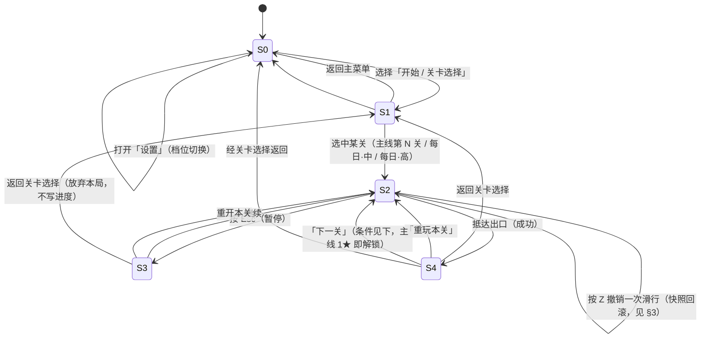

# UX 规格 · 俯视角 2D 网格迷宫寻路闯关

> **Task ID**：P4-UX ｜ **角色**：design-strategist（文策渊）｜ **优先级**：高
> **Phase**：4 预制作 ｜ **状态**：待主理人评审
> **上游（已读、与裁决一致）**：`phase4-brief.md` 成员 A 章节 ｜ `gdd/01-movement-input.md`（五动词 / 滑行 S1–S4 / 撤销 Z / HUD 顶部条 / cellRenderState）｜ `art-bible.md` v2.1.1（§2 动效时长、§6 Q3 顶部条裁决、WCAG 2.3.1）｜ `accessibility/feature-matrix.md`（AC-1~AC-5、Standard/Comprehensive）｜ `gdd/06-daily-seed.md`（每日两条/天、中+高、UTC、主线通关解锁）
> **下游（读取，不重定义）**：`gdd/02`（RunState/Step/CellKey）、`gdd/03`（开门）、`gdd/04`（星级）

**本文档只描述行为、字段、状态、时长、键位，不含任何实现代码（无 .ts/.js）。**

---

## 0. 全局约束与术语一致性

- **顶部状态条（非左侧竖栏）**：Q3 已由用户裁决不采纳左侧竖栏方案（`art-bible` §6 Q3、`feature-matrix` U2）。HUD 恒为**顶部 32px 横条、DOM 实现**。
- **R = 2**（上限 3）：视野半径当前为 2（切比雪夫距离），全程不随关卡变化；2026-09-09 由 3 收窄至 2 以提升难度（ADR-03 修订），上限仍为 3；属玩法冻结项，本规格不重复约束。
- **撤销粒度 = 一次滑行**：Z 撤销回滚"一整次滑行"的快照，非单格、非整段回头；与 GDD① §4.5、架构 L5 一致。
- **每日两条**：每天"每日 · 中" + "每日 · 高"各一条，`visionMode` 恒为 `'fog'`；仅主线 12 关全部 ≥1★ 后解锁（GDD⑥）。
- **动效频率红线**：任何内容不得出现 ≥3Hz 的周期性闪烁。失败反馈为**单脉冲 1 次 / 250ms**（不构成周期性 flash，AC-5 / WCAG 2.3.1 合规）。
- **A5 准确口径**：A5「移动插值 ≤200ms」约束对象仅为**移动插值**，非全部动效。过场/结算动效不受 A5 约束（详见 §4）。
- **术语**：滑行 = 走廊滑行（S1–S4 终止谓词）；回溯段数 = 当前本局可撤销的滑行次数（快照栈深度）；回溯 = 撤销。

---

## 1. 顶层应用状态流

### 1.1 状态节点（共 5 个顶层节点 + 1 个条件门禁）

| 节点 ID | 状态名 | 说明 |
|---|---|---|
| **S0** | `MENU` 主菜单 | 标题 + 入口（开始/关卡选择/设置）。可访问性档位开关在此可达。 |
| **S1** | `LEVEL_SELECT` 关卡选择 | 含「主线」分区（12 关网格）与「每日」分区（解锁后出现）。 |
| **S2** | `PLAYING` 游玩中 | 关卡运行态：接收输入、执行滑行/撤销/重开、计算视野与 HUD。 |
| **S3** | `PAUSED` 暂停 | 由 `PLAYING` 按 Esc 进入；遮罩式菜单（继续/重开/返回选关）。 |
| **S4** | `SETTLEMENT` 结算 | 抵达出口后进入；展示星级 + 回溯段数 + 明细。 |

> **条件门禁 `GATE_DAILY`**（非独立节点，属 S1 的显示条件）：仅当 `mainProgress.allMainCleared == true`（12 关全部 ≥1★）时，S1 才渲染「每日」分区。未解锁时该分区**不显示、不灰显、不预告**（GDD⑥ D-1，避免诱使跳过教学）。

### 1.2 状态转移图（mermaid）

### 1.3 关键转移条件说明

| 转移 | 触发 | 前置 / 条件 | 备注 |
|---|---|---|---|
| S1 → S2（主线） | 选中第 N 关 | 第 N 关已解锁（第 1 关恒开；第 N>1 关需第 N-1 关 ≥1★） | 1★ 即解锁下一关（GDD① §4.8） |
| S1 → S2（每日） | 选中每日·中 / 每日·高 | `GATE_DAILY` 已满足（主线全通） | 同一天同档 `seed` 恒定，跨浏览器同图 |
| S2 → S4 | 角色踏入出口格 | 视为「成功」，定格计时并结算 | 结算必显示星级明细（GDD④ §2.3） |
| S2 → S2（失败重开） | 失败条件触发 | 失败 = 走入死局且无可撤销（无钥匙无法前进且 `path` 空/不可解） | 失败 vignette 250ms 单脉冲后自动回到本关初始态；**失败不计入解锁统计**，不影响星级 |
| S4 → S2（下一关） | 选「下一关」 | 当前关已 ≥1★（必然成立，因已结算） | 主线第 12 关结算后无「下一关」，仅「重玩 / 返回」 |
| S3 → S1 | 选「返回关卡选择」 | 放弃本局，**不写进度**、不记录失败 | 与 S2→S2 重开区分：前者离开游玩态、后者重置态 |

> **失败重开的特殊性**：失败不进入独立状态节点，而是在 `PLAYING` 内以 vignette 反馈 + 自动重置表达（避免打断节奏，且失败不算"结算"）。R 重开为玩家主动、同样滞留 `PLAYING`。设计意图：失败是低惩罚、可瞬间重试的事件，不应有"失败页"。

---

## 2. HUD 顶部状态条

### 2.1 实现约束

- **位置/尺寸**：屏幕顶部，**高 32px**，横贯画布宽度（`art-bible` §6 / `feature-matrix` U2）。
- **实现方式**：**DOM 元素**（非 Canvas），底 `#EFEADC`(92% 透明)，下边框 1.5px `#C9BFA9`（`art-bible` §2⑥）。
- **不占用迷宫区高度**：迷宫区可用高度 592px 不变，守住「一屏一关」（A6 / U1）。
- **可达性**：语义化标签 + `aria-live` 播报状态变化（U7）；字号三档 `--ui-scale` = 1.0/1.25/1.5，基准 ≥14px（U5）。
- **操作提示区**常驻：`Z 撤销 · R 重开 · Esc 返回`。

### 2.2 字段定义（左 → 右 布局）

| 区 | 字段 | 数据来源 | 定义 / 取值 | 渲染要求 |
|---|---|---|---|---|
| 左 | `levelLabel` 关卡标签 | RunState | "第 7 关" / "每日 · 中" / "每日 · 高" | 主文字 `#2A2419` |
| 中左 | `keys` 钥匙持有 | RunState.heldKeys | ≤3 槽：每槽=颜色 + 形状标记（菱形/三角/六边）双重编码；未持有显空槽 | 配对色：`#0E635A`/青·菱形、`#5A3189`/紫·三角、`#A85B1E`/赭·六边（GDD③ K3） |
| 中 | `doorStatus` 门状态 | RunState.doorsOpened / doorsTotal | `已开门/总门数`（如 2/3）；无锁关卡该区留空 | 仅在有锁关卡显示 |
| 中右 | `steps` 步数 | RunState.steps | 本局累计步数（撞墙不计、撤销回滚） | 整数 |
| 中右 | `elapsedMs` 计时 | RunState.elapsedMs | 本局真实时长（撤销/重开均不返还） | mm:ss |
| 右 | `undoSegments` 回溯段数 | 快照栈深度 | **当前本局可撤销的滑行次数**（= 已成功滑行且未回滚的次数 = 快照栈深度）。撤销一次 −1，重开清零 | 整数；为 0 时操作提示中"撤销"置灰 |
| 右 | `starPreview` 当前星级预览 | 实时按 GDD④ 阈值计算 | 依据当前 `path`/`steps`/**回头路擦除后**的净步数实时估算的 1–3★ 预览；随步数实时变化 | 用 ★/☆ 表达；非最终结算值 |
| 右(常驻) | 操作提示 | 静态 | `Z 撤销 · R 重开 · Esc 返回` | 次要文字 `#6B6152` |
| 关 9+ / 每日追加 | `fogLegend` 四态图例 | 固定 | 走过（带笔迹）/ 见过 / 未知 三色块 + 文字 | 仅 `visionMode='fog'` 显示（U4，避免关 1–8 认知过载） |

> **`undoSegments` 与 `starPreview` 的口径对齐**：
> - `undoSegments` = 快照栈深度，即"还能按几次 Z"。与 GDD① §4.5 撤销粒度=一次滑行一致；`visited` 单调不回滚、故回溯段数只减不随 `visited` 增长。
> - `starPreview` 为**预览**而非结算：结算（S4）才给出权威星级与明细；预览仅给玩家实时目标感，帮助"想的时间 > 走的时间"。

### 2.3 关 9+ 四态图例（fogLegend）色块映射

| 图例项 | 视觉 |
|---|---|
| 走过（带笔迹） | 通道底 `#EDE7DA` + 45° 笔迹 `#9C8F73` |
| 见过（视野内未走） | 通道底 `#F4F1EA` + 网格 `#A89878` |
| 未知 | 空白纸底 `#F4F1EA` + 极淡网格 `#E4DCCE` |

---

## 3. 输入映射表

### 3.1 移动（四向走廊滑行）

| 输入 | 语义 | 说明 |
|---|---|---|
| `↑` / `W` | 向上滑行 | 沿该方向连续前进至 S1–S4 终止（见下） |
| `↓` / `S` | 向下滑行 | 同上 |
| `←` / `A` | 向左滑行 | 同上 |
| `→` / `D` | 向右滑行 | 同上 |

**走廊滑行规则（GDD① §2.3 / §4.2）**：一次按下 = 一次滑行。每进入新格后按序求值终止谓词：

| 序 | 终止条件 | 语义 |
|---|---|---|
| S1 | 前方不可通行（墙 / 无法开启的门） | 抵墙/抵锁门，停当前格（撞墙不计步） |
| S2 | 当前格有实体（钥匙/门/出口） | 让玩家 conscious 停下 |
| S3 | 当前格是通行路口（存在可通行垂直邻格） | 交还决策权 |
| S4 | 当前格在本次滑行中已走过 | 环形走廊保护，防无限循环 |

**多键/连走**：同时多方向以最近按下（`dirStack` 栈顶）为准；长按连走禁用 OS auto-repeat，自管节奏 `initialDelay=220ms`、之后每 `110ms` 发起一次新滑行且须等上一次滑行结束；`window.blur` 清空输入栈。

### 3.2 功能键

| 键 | 语义 | 行为 | 边界 |
|---|---|---|---|
| **Z** | 撤销（一次滑行） | 弹栈回滚快照 `{pos, keysHeld, doorsOpened, pathLength, steps}`；`visited` **不**回滚、`elapsedMs` 不回滚 | 见 3.3「滑行中按 Z」；`path` 为空时按 Z 无操作（GDD① E4） |
| **R** | 重开本关 | 整关重置到初始状态；本局作废、`path` 清空、计时重置 | 不计入失败统计、不影响解锁（GDD① §2.4 / E7） |
| **Esc** | 暂停 / 菜单 | `PLAYING → PAUSED`；暂停菜单含「继续/重开/返回关卡选择」 | 在 S3 中再按 Esc = 继续（或保持暂停，由实现定）；结算态 S4 不响应 Esc |

### 3.3 滑行中按 Z 的精确语义（架构 L5 / GDD① §4.5）

> 这是工程侧最易误解点，显式写死：

- **触发时机**：一次滑行正在进行（角色正沿方向连续前进、尚未抵达 S1–S4 终止格）时收到 Z。
- **行为**：**丢弃剩余格**（立即停止当前滑行的后续前进），并**回滚到本次滑行前的快照**——即角色回到本次滑行起点格，`keysHeld`/`doorsOpened`/`path`/`steps` 全部回到滑行前状态。
- **效果等价**：滑行中按 Z ≡「本次滑行从未发生过」（但 `visited` 不回滚，因 `visited` 单调递增）。
- **`undoSegments` 变化**：该次滑行的快照被消费，回溯段数 −1；若栈空则 Z 无操作。
- **理由**：一次按键对应一次滑行、撤销与按键 1:1 最符合直觉；若只"停在当前半路格"会让玩家处于非对齐/非决策点，违背「格对齐」原则（GDD① §2.2）。

---

## 4. 反馈流（动效时长与触发）

### 4.1 动效分类与 A5 约束归属

> A5 判据 = **移动插值 ≤200ms**，约束对象仅为移动插值。据此分三类（与 `feature-matrix` §3.1 一致）：

| 类别 | 项目 | 时长 | 受 A5 约束 |
|---|---|---|---|
| ① 移动插值（硬约束） | 格移动 | **120ms**（smoothstep） | ✓（上限 200ms） |
| ② 交互反馈 | 撞墙 80ms · 拾取 200ms | ≤200ms | ✓（本就在限内） |
| ③ 过场/结算 | 开门 280 · 失败 250 · 过关 400 · 切关 250+250 · 入迷雾 600 | >200ms | ✗ **不受 A5 约束** |

**③ 类免责三前提（必须同时满足）**：①不阻塞输入（过场期间可继续操作或可立即跳过，阻塞 ≤200ms）；②受 `motionScale` 控制（`feature-matrix` M2）；③不承载"必须被看见才知道"的信息——唯一例外 M3 状态联动（拿到钥匙→对应门立即由交叉网格变实心），`motionScale=0` 时须退化为瞬时切换。

### 4.2 反馈动效时长表（权威值）

| 事件 | 视觉表现 | 时长 | 频率合规 |
|---|---|---|---|
| **格移动** | 角色格→相邻格插值 | **120ms** | A5 ✓ |
| **撞墙** | 角色位移 6px 弹回 + 墙体纹理加深一档 | 80ms | A5 ✓ |
| **拾取钥匙** | 钥匙缩小淡出 + 上浮 + 粒子；HUD 钥匙计数 +1 弹跳 | 200ms | A5 ✓ |
| **状态联动**（门网格→实心） | 拿到钥匙→对应门立即由交叉网格变实心 + 锁孔开口 | **瞬时（信息，非装饰）** | 硬约束 M3，不可关闭 |
| **开门** | 门分两半滑出淡出 + 墨迹闪过 | **280ms** | 过场，A5 ✗ |
| **过关** | 出口墨环扩散全屏 + 角色缩小淡出；HUD 计时定格 | **400ms** | 过场，A5 ✗ |
| **失败** | 红褐色边缘 vignette **闪 1 次（单脉冲）+ 玩家淡出 + 轻微下沉** | **250ms** | **单脉冲，不构成周期性 flash，WCAG 2.3.1 合规（AC-5）** |
| **切关** | 旧关淡出 250ms + 新关淡入 250ms | **250+250ms** | 过场，A5 ✗ |
| **进入迷雾关（关 9）** | 一次性全屏墨迹扩散揭示 + 四态图例高亮一次 | 600ms | 过场，A5 ✗ |

> **失败 vignette 重点（AX-3 已闭环）**：v2 原「闪 2 次 / 320ms ≈ 6.25Hz」超标一倍，v2.1 已修正为 **1 次 / 250ms 单脉冲**。单脉冲不产生周期频率，不触发 3Hz 红线。本规格绑定该裁决，禁止回归双闪。

### 4.3 失败反馈与重开的 UX 链路

`PLAYING` 内失败 → 播放失败 vignette（250ms 单脉冲，玩家淡出+下沉）→ 动画结束后**自动回到本关初始态**（同 R 重开语义：path 清空、计时重置、pos 归位、heldKeys 清空；`visited` 按规则处理）→ 玩家可立即重试。失败**不离开 `PLAYING`、不进结算、不写进度、不影响解锁**。

---

## 5. 可访问性开关入口

### 5.1 档位模型

> **Basic 档不成立**（不提供）：图案编码是 v2 核心识别通道、对比度达标是色表设计前提，二者均为必需项，降到 Basic 即破坏可辨识性（`feature-matrix` §4 / `art-bible` §4）。故仅 **Standard（推荐，~2.2 天）/ Comprehensive（~5–7 天）** 两档。

**入口位置**：`MENU` → 「设置」→ 可访问性档位（Standard / Comprehensive）+ 各子项开关。设置可随时进入，游玩中经 `PAUSED` 亦可跳转设置。

### 5.2 两档与 AC-1~AC-5 的对应

| 门禁 | 名称 | Standard（MVP 即达标） | Comprehensive 增量 |
|---|---|---|---|
| **AC-1** | 六类元素 1 秒可识别性 | 形状+图案双编码 + 对比度达标（Phase 6 门禁，≥90% 平均） | 追加三型色盲色表实测验证 |
| **AC-2** | 关 1–8 不出现未知态 | `visionMode='full'` 分支保证（GDD① V6） | 同（硬约束） |
| **AC-3** | 对比度逐项核验 | 文本 ≥4.5:1（AA）、识别线 ≥3:1（`feature-matrix` V5/V6） | 文本 ≥7:1、全部图形 ≥3:1、高对比模式 |
| **AC-4** | `motionScale=0` 功能完整 | 减少动效开关（全局 `motionScale` 1.0/0.5/0）；信息类变化瞬时可见 | 追加逐项动效开关 |
| **AC-5** | 无 ≥3Hz 闪烁 | 失败单脉冲 1 次/250ms（已闭环） | 同（硬约束） |

### 5.3 Standard 档必含的可访问性子项（UX 入口可见）

- **图案填充第二编码**（V2，不可关）：墙 45° 斜线 / 门交叉网格 / 出口同心圆 / 通道无。
- **四态图例常驻**（U4，关 9+/每日）：降低迷雾认知负担。
- **迷雾减淡**（F4）：记忆态墙对比度 2.14:1 → ≥3:1。
- **关闭迷雾**（F5，已采纳进 MVP）：覆盖 `cellRenderState` 返回值，复用关 1–8 全烘焙路径；不改 `visible`/`visited`/`path`/星级。
- **减少动效开关**（M2）：`motionScale` 三档。
- **字号三档**（U5）：`--ui-scale` 1.0/1.25/1.5。
- **键盘可达 + 焦点环**（U6）：`focus-visible` 2px `#0E635A` + 2px 偏移。
- **屏幕阅读器**（U7）：HUD 走 DOM + `aria-live`。

### 5.4 Comprehensive 档追加项（UX 入口可见）

- 三型色盲色表（V7）+ 实测验证（AC-1 强化）。
- 高对比模式（V8）：识别线提至 ≥3:1、文字 ≥7:1。
- 逐项动效开关（M6）：屏幕震动/闪光/粒子/循环动画独立控制。
- 无级字号 + 行高字距调整（U5 升级）。
- （注：AX-2「视觉替代音效」已作废——MVP 不含音频；AX-1「增强记忆」不纳入 MVP，列为 Comprehensive 候选增强。）

> **降级底线（§5 原则）**：凡关闭即丢信息的特性不做成开关——V2 图案填充、V3 钥匙双编码、V5/V6 对比度、M3 状态联动、F2 铅笔笔迹、F3 墙邻感知，均不可关闭。`motionScale=0` 时仅装饰类消失，信息类须瞬时可见（AC-4）。

---

## 6. 跨文档一致性自检（回主理人）

| 检查项 | 上游裁决 | 本规格落点 |
|---|---|---|
| 顶部条而非左侧竖栏 | `art-bible` §6 Q3 / `feature-matrix` U2 | §2.1 顶部 32px DOM 横条 |
| R=2 视野（上限 3） | GDD① §4.6 / `art-bible` §2⑦ | §0 冻结，不重定义 |
| 撤销粒度=一次滑行 | GDD① §4.5 / 架构 L5 | §3.2 Z、§3.3 滑行中 Z |
| 每日两条(中+高) | GDD⑥ §2.1 | §1.1 `GATE_DAILY` + S1 每日分区 |
| 失败单脉冲 250ms | `art-bible` v2.1.1 / AX-3 / AC-5 | §4.2 时长表 + §4.3 |
| A5=移动插值≤200ms | `feature-matrix` §3.1 | §4.1 三类划分 |
| Basic 不成立 | `feature-matrix` §4 | §5.1 仅 Standard/Comprehensive |
| ≥3Hz 闪烁禁止 | WCAG 2.3.1 / AC-5 | §0 红线 + §4.2 |
| HUD 字段对齐 GDD① §4.8 | HudState | §2.2 七字段 + 四态图例 |

---

*UX 规格结束 · P4-UX · 待主理人评审与跨成员一致性检查*
